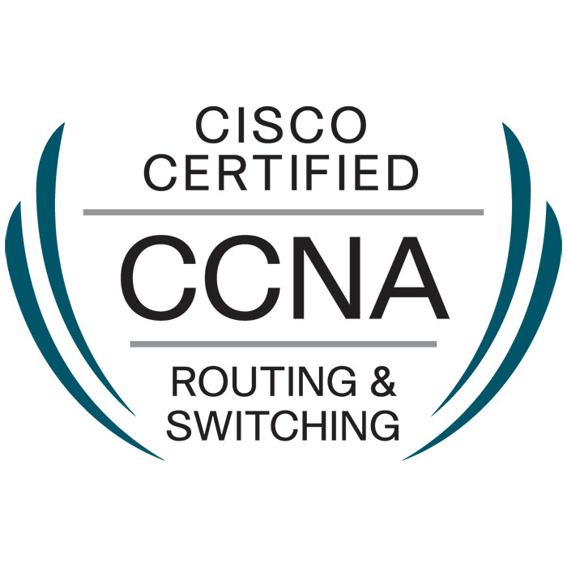
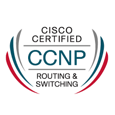

# Profile

Expert engineer with more than 15 years deep hands-on experience in networking, virtualization and cloud technologies. Throughout my career, I operated and supported large production networks, designed solutions for large groups, led collaboration efforts with various technology partners in the SDN / SD-WAN space, as well as worked on identifying business opportunities in 5G and Edge Computing.

# Technical Experience

## <ins> Lenovo </ins>
**Technical Business Development Manager (EMEA)** 
_February 2020 – Present_

- Identifying and implementing new growth opportunities in the Telco market. Focusing around Edge Computing, IoT and 5G use-cases. 
- Actively engaging with customers and tailoring solutions to fit their environment. Working on designing Edge Computing solutions and identifying the requirements. 
- Working with multiple partners to create feature-rich integrations involving Lenovo products and building the strategic partner ecosystem. 
- Closely working with the development team to define the product strategy and adapt it to customer needs

## <ins> Nuage Networks (Nokia) </ins>
**Technical Marketing Expert, then Technology Partner Program Lead** 
_May 2016 – January 2020_

Leading the Technology Partner Program at Nuage Networks. Responsible for technical integration projects with Nuage Networks partners that include writing and publishing technical content related to the solution features and integration into customer use-cases (white-papers, solution briefs, integration guides, etc.)(please refer to the **Publications** section at the end of this document) and various cloud and network automation projects. My specific duties included:
- Building PoCs with a variety of cloud and networking solutions; Automating the deployment of virtual labs (Python, Ansible, Terraform). Collaborating with marketing team on external demonstrations
- Deploying the Nuage Networks solution with partner products and major Operating Systems, hypervisors and cloud management systems.
- Providing design recommendation to various sales groups
- Performing live demonstrations to customers and tradeshow audiences
- Developing prototype solutions to address new use-cases that include the Nuage Networks solution
- Publishing relevant technical partner related documentation and raising awareness about joint value proposition with technology partners

## <ins> Orange, France </ins> 
**Senior Network and Virtualization Engineer** 
_May 2014 – April 2016_

Testing and implementing SDN and NFV solutions. Creating IaaS platforms based on solutions like VMware NSX, Juniper Contrail and Nuage Networks. Design and architecture of Openstack platforms and integration with SDN solutions. Troubleshooting and analyzing SDN solutions network functionalities and performance. Projects include
- VMware NSX SDN (Software Defined Networking) solution industrialization
- VIM (Virtual Infrastructure Manager) and SDN Integration
- Network Platform Design and management

## <ins> Sogeti (Capgemini), Toulouse, France </ins>
**Senior Network Engineer** 
_July 2011 – November 2014_

Level 3 support and expertise of network and security equipment in large-scale enterprise networks. Maintaining 24x7 network environments. Implementing TCP/IP Core network services. Designing and deploying network systems. Projects include
- Airbus/EADS Email rebranding project (Migration of 240 000 Users Mailboxes from @eads.com to @airbus.com. Network and infrastructure planning, design and implementation)
- Solfea Bank Network Design and Reconstruction (Design and implementation from scratch of a network architecture, consisting of 2 Data Centers and 1 Users site. Creation of a Core/Distribution/Access network model using dynamic routing services (OSPF/BGP) and LAN segmentation (VLAN) and redundancy services (Link Aggregation/Spanning Tree).
- Credit Agricole L2/L3 Network Support (Support of large-scale network (several thousand users))

## <ins> CNRS, Toulouse, France <ins>
**Research & Development Engineer**  
_September 2009 – November 2010_
Research work involving tests and development of new standards in automotive embedded networking (CAN/LIN/FlexRay/Real-time ethernet). Analysis and modelling of QoS mechanisms for embedded network protocols

## <ins> Eventis Mobile, Chisinau, Moldova </ins>
**Network Engineer**  
_July 2007 – August 2008_

Configuration and administration of Cisco switches and Routers (Catalyst 2950/2960/2750/4500/6500 and 4000m/3600/3000/2600/1600). Routing protocols OSPF/EIGRP/BGP. Interconnecting GGSN and SGSN Systems with IP Core

## <ins> Casa Farm, Chisinau, Moldova </ins>
Systems and Network Administrator  
_September 2002 – June 2007_

Part-Time Network and Systems Administrator. Design and implementation of a network consisting of 80 PCs. Implementation of various services like DNS, Active Directory, DHCP, Mail, DMZ, VPN (5 Remote locations)

# Certifications

# Education
## <ins> ENSEEIHT, Toulouse, France </ins>
**Master's Degree in Networking**   
_September 2008 – September 2009_

Master’s Degree in Networking and Telecom at National Polytechnic Institute of Toulouse (ENSEEIHT)

## <ins> Technical University of Moldova, Chisinau, Moldova </ins>
**Bachelor’s degree**  
_September 2002 – August 2007_

Faculty of Radio electronics and Telecommunications, specialty of Telecommunications 

# Publications
- White-Paper: [Meeting the expectations of digital shoppers with SD-WAN](https://github.com/alexnastas/resume/raw/gh-pages/publications/Nokia_Nuage_Networks_Transforming_Retail_Networks_w_SD-WAN_White_Paper_EN.pdf)
- White-Paper: [OpenStack networking: The challenges and a new hope](https://github.com/alexnastas/resume/raw/gh-pages/publications/Nokia_Nuage_Networks_OpenStack_Networking_White_Paper_EN.pdf)
